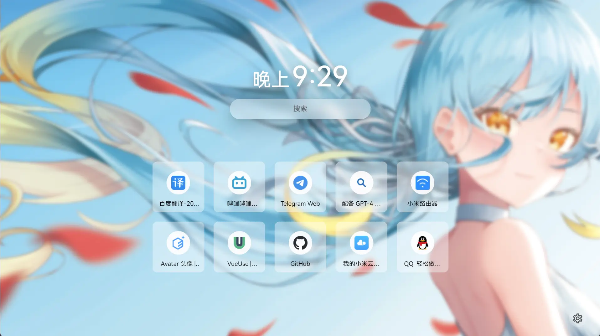
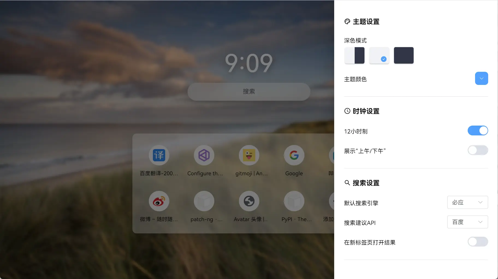

# 柠檬起始页（Lemon Tab Page）

一个非常简约的仿[青柠起始页](https://limestart.cn/)的纯本地新标签页实现。

## 安装使用

目前插件已在 [Chrome Web Store](https://chromewebstore.google.com/detail/bhbpmpflnpnkjanfgbjjhldccbckjohb)
、[Microsoft Edge 加载项](https://microsoftedge.microsoft.com/addons/detail/keikkgfgidagjlicckkangkfgnbdjdnh)
和 [Firefox Browser Add-Ons](https://addons.mozilla.org/zh-CN/firefox/addon/%E6%9F%A0%E6%AA%AC%E8%B5%B7%E5%A7%8B%E9%A1%B5/)
上架

> 你也可以 Clone 下来手动 Build 一份来使用

## 特性

- :art: 基本复刻青柠起始页的主界面UI及相关动画
- :top: 展示最常访问的网站
- :framed_picture: 自定义壁纸或 Bing 每日一图
- :crescent_moon: 深色模式（用于搭配壁纸色调）
- :rainbow: 壁纸模糊、壁纸遮罩、壁纸暗角
- :joystick: 切换搜索引擎、切换搜索建议来源
- :zap: 加载迅速

> 说明：
>
> 1. 更多功能欢迎 PR，提 Issue 不一定会实现噢

## 为什么会有这个插件？

青柠起始页是一个在线服务不能离线使用，之前我网络环境不好，每当打开浏览器或切换标签页总是会先加载一下，虽然时间不长但还是有股卡顿感。

并且青柠起始页由于并不是浏览器插件本身的页面，因此不支持展示经常访问网站，而我个人更习惯直接打开经常访问的网站。

另一方面，青柠起始页把快速访问放在了需要鼠标右键点一下的二级页面，而我更喜欢在新标签页中直接打开常用网站。

然而，青柠起始页不是个开源项目不好魔改，所以我决定根据自己需求模仿一个。

### 有什么不同？

和青柠起始页相比，柠檬起始页完全在本地运行。网络环境不好、公司内网、无网环境时也可以使用。而青柠起始页极度依赖其服务器，不管是页面本身还是搜索建议，假如网络不好或开发者服务器不可用时，青柠檬起始页会无法正常工作。

得益于本地运行，柠檬起始页可以做到打开新标签页时秒速展示，无需等待网络请求。

> Bing 每日一图及搜索联想功能在无网或弱网环境时无法使用。

### 对比

> 根据个人需求开发所以很多功能都没有，但欢迎 PR（提 issue 不一定会实现）

|    主要功能    |  柠檬起始页  | 青柠起始页 |
| :------------: | :----------: | :--------: |
|    最常访问    |      ✅      |     ❌     |
|   自定义壁纸   |      ✅      |     ✅     |
|    深色模式    |      ✅      |     ✅     |
|    视频壁纸    |      ❌      |     ✅     |
|      一言      |      ✅      |     ✅     |
|      便笺      |  不计划支持  |     ✅     |
| 自定义快速访问 |      ✅      |     ✅     |
|    设置同步    | 暂不计划支持 |     ✅     |

## 浏览器兼容性

| 浏览器  | 支持 |         说明          |
| :-----: | :--: | :-------------------: |
| Chrome  |  ✅  | Chrome 96 及更高版本  |
|  Edge   |  ✅  |  Edge 96 及更高版本   |
| Firefox |  ✅  | Firefox 63 及更高版本 |

## 预览

<details>
<summary>点击展开图片</summary>




</details>

## 开发（Development）

本项目使用 Vue 3 + Vite 4 + TypeScript + Element Plus 开发。

> [!NOTE]  
> 本人没系统学习过 HTML / CSS / JS / TS / Vue，代码质量可能不高，欢迎提 Issue 和 PR

### 构建（Build）

#### 如果你使用 Chrome 浏览器（For Chrome）

```sh
git clone https://github.com/Redlnn/lemon-new-tab-page.git
cd lemon-new-tab-page
pnpm install
# pnpm dev  # 运行开发环境，会启动一个独立的浏览器
# 构建
pnpm build  # 构建为（未压缩的）Chrome 扩展
pnpm zip  # 打包 Chrome 扩展
```

### 如果你使用 Firefox 浏览器（For Firefox）

```sh
git clone https://github.com/Redlnn/lemon-new-tab-page.git
cd lemon-new-tab-page
pnpm install
# pnpm dev  # 运行开发环境，会启动一个独立的浏览器
# 构建
pnpm build:firefox  # 构建为（未打包和签名的）Firefox 扩展
pnpm zip:firefox  # 打包 Firefox 扩展
```

## 鸣谢

- [青柠起始页](https://limestart.cn/)

  > 柠檬起始页的模仿对象，模仿了布局和动画，参考了部分 CSS

- [Light Tab Page 轻标签页](https://github.com/Devifish/light-tab-page)
