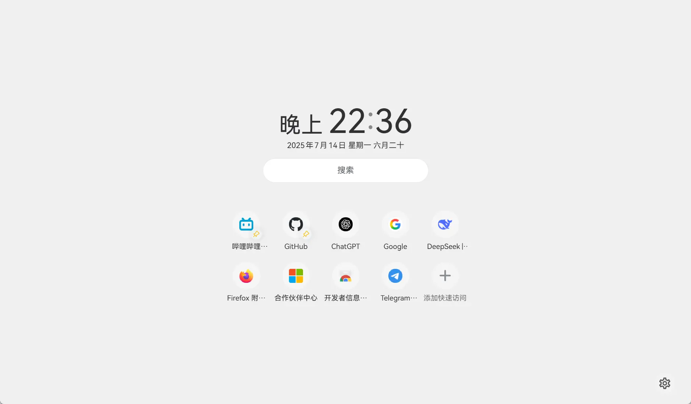

<div align="center">

[Enlgish](README_en.md) | 简体中文

</div>

## 安装

目前扩展已在 [Chrome Web Store](https://chromewebstore.google.com/detail/bhbpmpflnpnkjanfgbjjhldccbckjohb)
、[Microsoft Edge Add-Ons](https://microsoftedge.microsoft.com/addons/detail/keikkgfgidagjlicckkangkfgnbdjdnh)
和 [Firefox Browser Add-Ons](https://addons.mozilla.org/firefox/addon/lemon-new-tab/)
上架

> 你也可以 Clone 下来手动 Build 一份来使用

## 特性

- 极速⚡ —— 纯本地、高性能，加载迅速
- 搜索🔍 —— 提供即时建议与可自定义搜索引擎选择
- 多变🌈 —— 通过丰富的自定义选项根据喜好自由组合页面样式
- 美观🎨 —— 借助丰富的自定义配色与莫奈取色，让界面更加清爽与美观
- 壁纸🖼️ —— 可选择 Bing 每日一图、任意在线图片 API、本地图片/视频作为壁纸
- 一言💬 —— 每次打开新页面都会为您展示一句古诗词或励志语录
- 开源⚛️ —— 无需担心隐私泄露或恶意代码
- 国际化🌐 —— 内置多语言支持（目前包含简体/繁体中文、粵語、英文）
- 书签🔖 —— 可搜索、打开浏览器已收藏的书签
- 快速访问🪜 —— 支持显示、置顶常用网站，开箱即用，并支持新增自定义快速访问链接
- 昼夜变化🌓 —— 支持深色模式，可设为自动跟随系统切换

> [!NOTE]  
> 本扩展模仿了青柠起始页的部分样式，不喜勿喷  
> 更多功能欢迎 PR，提 Issue 不一定会实现噢

## 更新日志（Changelog）

[中文](./CHANGELOG.md) | [English](./CHANGELOG_en.md)

## 浏览器兼容性

|              浏览器              | 支持 |          说明          |
| :------------------------------: | :--: | :--------------------: |
|              Chrome              |  ✅  | Chrome 116 及更高版本  |
|               Edge               |  ✅  |  Edge 116 及更高版本   |
|             Firefox              |  ✅  | Firefox 128 及更高版本 |
|          Firefox Mobile          |  ❌  |   因功能受限故未上架   |
| 基于 Chromium<br/>的移动端浏览器 |  ❓  |        未经测试        |
|           Edge Mobile            |  ❓  |        未经测试        |

> 柠檬起始页自适应横竖屏模式，但未在移动端浏览器上测试及上架，故不保证兼容性

## 预览图

<details>
<summary>点击展开图片</summary>





</details>

### 与青柠起始页对比

> 根据个人需求开发所以很多功能都没有，但欢迎 PR（提 Issue 不一定会实现）

|    主要功能    | 柠檬起始页 |    青柠起始页    |
| :------------: | :--------: | :--------------: |
|  最常访问网站  |     ✅     |        ❌        |
| 查找浏览器书签 |     ✅     |        ❌        |
|   自定义壁纸   |     ✅     |        ✅        |
|    深色模式    |     ✅     |        ✅        |
|    视频壁纸    |     ✅     |        ✅        |
|      一言      |     ✅     |        ✅        |
|    设置同步    |     ✅     | ✅（需注册账号） |
| 自定义快速访问 |     ✅     | ✅（需注册账号） |
| 自定义搜索引擎 |     ✅     | ✅（需注册账号） |
|      便笺      |     ❌     |        ✅        |
|      天气      |     ❌     |        ✅        |
|  个人项目推广  |     ❌     |        ✅        |
|    账号系统    | 浏览器自带 |       独立       |

## 为什么会有这个扩展？

<details>
<summary>主要有以下几个原因（碎碎念警告）：</summary>
<br />

1. Chrome 设置默认搜索引擎为非 Google 后新标签页就没有搜索栏和壁纸
2. Chrome 搜索引擎改成 Bing 后和 Edge 一样新标签页变成了 Bing 首页，多余的按钮、新闻很丑，且搜索栏和快捷方式都很靠上，不好看也不中用
3. 个人喜欢青柠起始页的外观，然而青柠起始页是一个每次打开都会进行一次 http 请求的网页，准确来讲其实是导航页而不是起始页（非常不能理解为什么要放在服务器上）
4. 青柠并不是原生浏览器扩展，不支持展示经常访问网站（同上，非常不能理解），而我个人更习惯直接打开经常访问的网站
5. 青柠起始页把快速访问放在了二级页面，而我更喜欢在新标签页中直接打开常用网站，虽然可以默认进入二级页面但是就看不到搜索栏了
6. 青柠起始页不是个开源项目不好魔改，所以我决定根据自己需求模仿一个
7. 怎么会有新标签页添加个快速访问或者搜索引擎都要注册账号的（继续不能理解）

> ~~听闻青柠起始页准备重构并且添加新功能了，也许新版会满足我的需求，然后就停更了呢？~~  
> 更新了，结果基本是 UI 调整，新功能不多（笑

</details>

## 开发

本项目使用 Vue 3 (TypeScript) + Element Plus 开发。

> [!WARNING]
>
> 1. 本人没系统学习过 HTML / CSS / JS / TS / Vue，代码质量可能不高
> 2. 本项目包含大量 AI 生成代码，仅经过简单 Review
>    确保功能正常，不包含恶意代码，其质量/性能或多或少可能存在问题，望各位谅解
> 3. 欢迎 PR

### 构建

#### 如果你使用 Chrome 浏览器

```sh
git clone https://github.com/Redlnn/lemon-new-tab-page.git
cd lemon-new-tab-page
pnpm install
# pnpm dev  # 运行开发环境，会启动一个独立的浏览器
# 构建
pnpm build  # 构建为（未压缩的）Chrome 扩展
pnpm zip  # 打包 Chrome 扩展
```

#### 如果你使用 Firefox 浏览器

```sh
git clone https://github.com/Redlnn/lemon-new-tab-page.git
cd lemon-new-tab-page
pnpm install
# pnpm dev  # 运行开发环境，会启动一个独立的浏览器
# 构建
pnpm build:firefox  # 构建为（未打包和签名的）Firefox 扩展
pnpm zip:firefox  # 打包 Firefox 扩展
```

## 已知问题

1. 部分 Windows 设备上的 Chromium 内核浏览器会在启动时卡死，**禁用 GPU
   硬件加速**或者在 [Experiments](chrome://flags/#use-angle) 页面将
   **Choose ANGLE graphics backend** 更改为 `OpenGL` 后可缓解
   > - 考虑是因为显卡驱动 / 系统问题等原因造成
   > - Chromium 不推荐使用 OpenGL API 渲染，改成其他也可能会有效（可能会不卡但掉帧）

## 鸣谢

- [青柠起始页](https://limestart.cn/)：柠檬起始页的模仿对象，模仿了布局和动画，参考了部分 CSS
- [Light Tab Page 轻标签页](https://github.com/Devifish/light-tab-page)：自定义壁纸储存的实现来源

## License

本项目以 MIT 协议开源，`entrypoints/newtab/assets` 中的涉及到商标的图片除外
