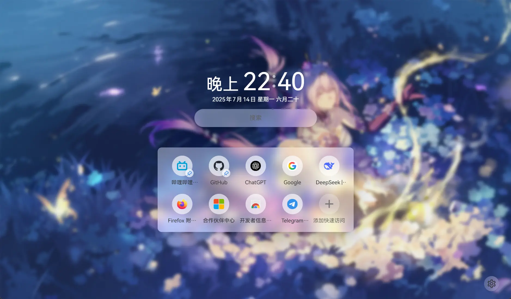
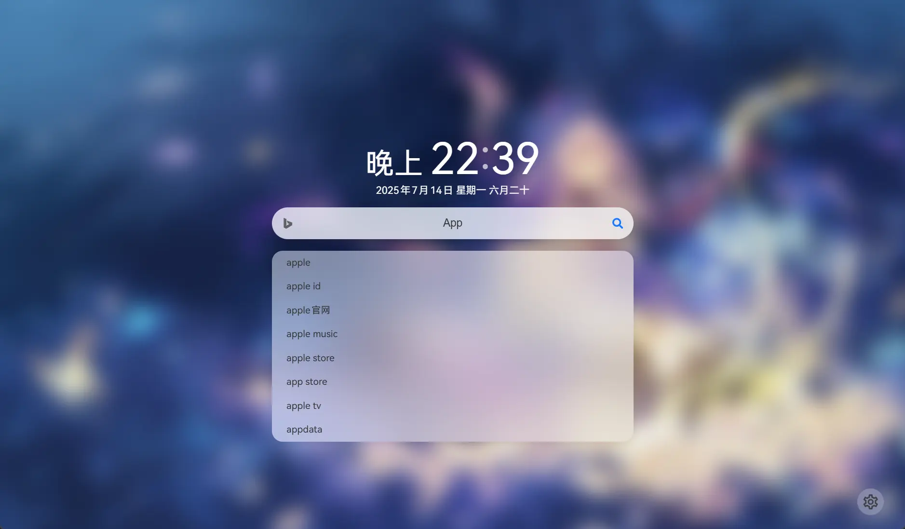
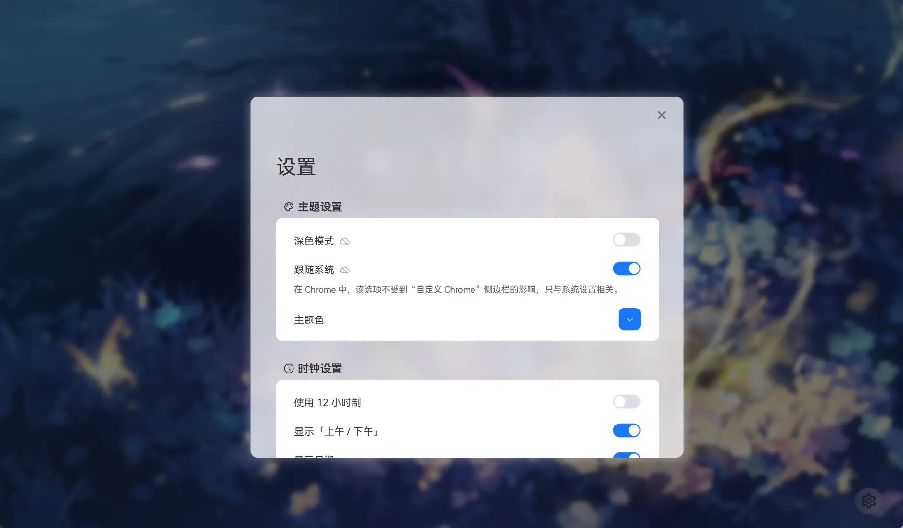

<div align="center">

Enlgish | [Chinese](README.md)

</div>

## Installation

The extension is now available on
[Chrome Web Store](https://chromewebstore.google.com/detail/bhbpmpflnpnkjanfgbjjhldccbckjohb),
[Microsoft Edge Add-Ons](https://microsoftedge.microsoft.com/addons/detail/keikkgfgidagjlicckkangkfgnbdjdnh), and
[Firefox Browser Add-Ons](https://addons.mozilla.org/firefox/addon/lemon-new-tab/).

> You can also clone this repo and build it manually.

## Features

- :zap: Lightning-fast loading
- :gear: Rich customization options for flexible layouts
- :top: Display most-visited sites and custom shortcuts
- :framed_picture: Use custom wallpapers or Bing daily wallpapers
- :joystick: Switch search engines and multiple suggestion sources
- :art: Partial UI and animation reproduction of Lime Start Page
- :atom_symbol: Open source
- :globe_with_meridians: Multi-language support (`en`, `zh-CN`, `zh-HK`, `zh-TW`)
  > `zh-HK` may not always work as expected. It theoretically works, but depends on browser behavior.

> [!NOTE]  
> This extension mimics part of Lime Start Page’s style—if that’s not your taste, please skip.  
> Contributions via PRs are welcome. Issues may not always be implemented.

## Changelog

[English](./CHANGELOG_en.md) | [Chinese](./CHANGELOG.md)

## Browser Compatibility

| Browser | Supported |        Notes         |
| :-----: | :-------: | :------------------: |
| Chrome  |    ✅     | Chrome 96 and above  |
|  Edge   |    ✅     |  Edge 96 and above   |
| Firefox |    ✅     | Firefox 63 and above |

## Preview

<details>
<summary>Click to expand screenshots</summary>

  
  
  
  


</details>

### Comparison with Lime Start Page

> Built to satisfy personal needs, so many features are missing. PRs welcome (issues may not always be addressed).

|    Key Features    | Lemon Start Page | Lime Start Page |
| :----------------: | :--------------: | :-------------: |
| Most-visited sites |        ✅        |       ❌        |
|  Custom wallpaper  |        ✅        |       ✅        |
|     Dark mode      |        ✅        |       ✅        |
|  Video wallpaper   |        ❌        |       ✅        |
|       Quotes       |        ✅        |       ✅        |
|  Custom shortcuts  |        ✅        |       ✅        |
|       Notes        |        ❌        |       ✅        |
|   Settings sync    |        ✅        |       ✅        |
|      Weather       |        ❌        |       ✅        |
| Project promotion  |        ❌        |       ✅        |
|   Account system   | Built-in browser |   Independent   |

## Why this extension?

<details>
<summary>Main reasons (rambling ahead):</summary>
<br />

1. When Chrome’s default search engine is set to something other than Google,
   the new tab page has no search bar or wallpaper.
2. Setting Chrome’s search engine to Bing makes the new tab page resemble
   Edge’s Bing homepage—with cluttered buttons, ugly news, and search bar/shortcuts
   placed too high.
3. I like Lime Start Page’s look, but it performs an HTTP request every time it opens.
   Strictly speaking, it’s a navigation page, not a start page
   (never understood why it’s server-hosted).
4. Lime Start Page is not a native browser extension and doesn’t support displaying
   frequently visited sites (again, baffling), while I prefer quick access to them.
5. Lime Start Page places shortcuts on a secondary page, but I want them on the main tab.
   Although you can default to that page, it hides the search bar.
6. Lime Start Page isn’t open source, making it hard to customize—so I decided
   to build my own based on my needs.

> ~~Heard Lime Start Page was getting a full refactor with new features,~~
> ~~maybe I’ll stop updating then?~~  
> It got updated, but mostly UI tweaks, not many new features (lol).

</details>

## Development

This project is built with Vue 3 (TypeScript) + Element Plus.

> [!NOTE]  
> I haven’t systematically studied HTML / CSS / JS / TS / Vue,
> so code quality may not be high. Issues and PRs are welcome.

### Build

#### For Chrome

```sh
git clone https://github.com/Redlnn/lemon-new-tab-page.git
cd lemon-new-tab-page
pnpm install
# pnpm dev  # Run development mode, opens in a standalone browser
# Build
pnpm build  # Build as (unminified) Chrome extension
pnpm zip    # Package Chrome extension
```

#### For Firefox

```sh
git clone https://github.com/Redlnn/lemon-new-tab-page.git
cd lemon-new-tab-page
pnpm install
# pnpm dev  # Run development mode, opens in a standalone browser
# Build
pnpm build:firefox  # Build as (unpacked & unsigned) Firefox extension
pnpm zip:firefox    # Package Firefox extension
```

## Known Issues

1. Some Chromium-based browsers on Windows may freeze at startup.
   Disabling **GPU hardware acceleration** or switching  
   **Choose ANGLE graphics backend** to `OpenGL` in
   [Experiments](chrome://flags/#use-angle) can help.
   > - Likely caused by GPU driver or system issues.
   > - Chromium discourages rendering via OpenGL API, but other settings may also help (might reduce stutter but risk frame drops).

## Credits

- [Lime Start Page](https://limestart.cn/): Inspiration for Lemon Start Page.
  Layout, animations, and some CSS were referenced.
- [Light Tab Page](https://github.com/Devifish/light-tab-page):
  Source of custom wallpaper storage implementation.

## License

This project is open-sourced under the MIT License, except for trademark-related images in `entrypoints/newtab/assets`.
