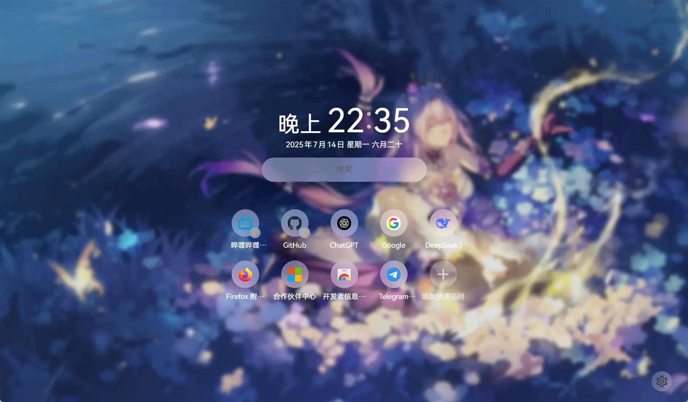

<div align="center">

[Simplified Chinese](README.md) | English

</div>

## Installation

The extension is now available on
[Chrome Web Store](https://chromewebstore.google.com/detail/bhbpmpflnpnkjanfgbjjhldccbckjohb),
[Microsoft Edge Add-Ons](https://microsoftedge.microsoft.com/addons/detail/keikkgfgidagjlicckkangkfgnbdjdnh), and
[Firefox Browser Add-Ons](https://addons.mozilla.org/firefox/addon/lemon-new-tab/).

> You can also clone this repo and build it manually.

## Features

- Fast⚡ – Purely local, high-performance, fast loading
- Search 🔍 – Instant suggestions and customizable search engine.
- Flexible 🌈 – Customize and combine page layouts to adjust appearance to your preference with rich options
- Elegant 🎨 – Clean and visually pleasing interface
- Wallpapers 🖼️ – Support for Bing daily wallpapers, custom online APIs, and local images/videos
- Quotes 💬 – A classical Chinese poem or motivational quote each time you open a new tab
- Open Source ⚛️ – No worries about privacy leaks or malicious code
- Internationalization 🌐 – Built-in multi-language support (Include Simplified / Traditional Chinese, Cantonese)
- Bookmark 🔖 – Search and open the bookmark from the browser
- Shortcuts 🪜 – Display/pin frequently visited sites and add your own custom shortcuts
- Dark Mode 🌓 – Support for dark mode, with an option to follow the system setting

> [!NOTE]  
> Contributions via PRs are welcome. Issues may not always be implemented.

## Changelog

[English](./CHANGELOG_en.md) | [Chinese](./CHANGELOG.md)

## Browser Compatibility

|              Browser               | Supported |                       Notes                        |
| :--------------------------------: | :-------: | :------------------------------------------------: |
|               Chrome               |    ✅     |                Chrome 116 and above                |
|                Edge                |    ✅     |                 Edge 116 and above                 |
|              Firefox               |    ✅     |               Firefox 128 and above                |
|           Firefox Mobile           |    ❓     | Not listed<br/>Unable to get the most visted sites |
| Chromium-based<br/>Mobile Browsers |    ❓     |                      untested                      |
|            Edge Mobile             |    ❓     |                      untested                      |

> Lemon Start Page adapts to both landscape and portrait modes,
> but has not been tested or published on mobile browsers, so compatibility is not guaranteed.

## Preview

<details>
<summary>Click to expand screenshots</summary>

  
  
  
  


</details>

## Development

This project is built with Vue 3 (TypeScript) + Element Plus.

> [!NOTE]  
> I haven’t systematically studied HTML / CSS / JS / TS / Vue,
> so code quality may not be high. Issues and PRs are welcome.

### Build

#### For Chrome

```sh
git clone https://github.com/Redlnn/lemon-new-tab-page.git
cd lemon-new-tab-page
pnpm install
# pnpm dev  # Run development mode, opens in a standalone browser
# Build
pnpm build  # Build as (unminified) Chrome extension
pnpm zip    # Package Chrome extension
```

#### For Firefox

```sh
git clone https://github.com/Redlnn/lemon-new-tab-page.git
cd lemon-new-tab-page
pnpm install
# pnpm dev  # Run development mode, opens in a standalone browser
# Build
pnpm build:firefox  # Build as (unpacked & unsigned) Firefox extension
pnpm zip:firefox    # Package Firefox extension
```

## Known Issues

1. Some Chromium-based browsers on Windows may freeze at startup.
   Disabling **GPU hardware acceleration** or switching  
   **Choose ANGLE graphics backend** to `OpenGL` in
   [Experiments](chrome://flags/#use-angle) can help.
   > - Likely caused by GPU driver or system issues.
   > - Chromium discourages rendering via OpenGL API, but other settings may also help (might reduce stutter but risk frame drops).

## Credits

- [Lime Start Page](https://limestart.cn/): Inspiration for Lemon Start Page.
  Layout, animations, and some CSS were referenced.
- [Light Tab Page](https://github.com/Devifish/light-tab-page):
  Source of custom wallpaper storage implementation.

## License

This project is open-sourced under the MIT License, except for trademark-related images in `entrypoints/newtab/assets`.
